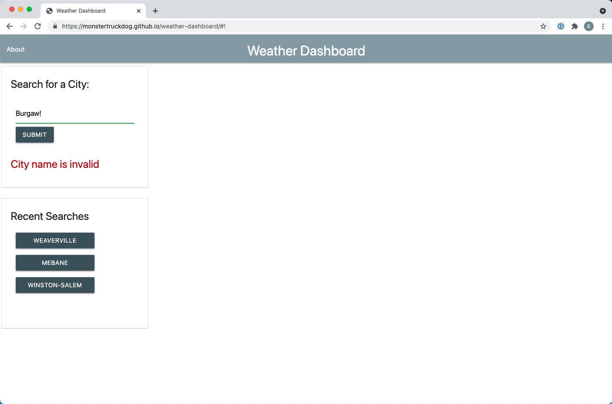

# Weather Dashboard

## Description

In order to both demonstrate and improve the knowledge and skills required for working with third party APIs, students are tasked with creating a weather forecasting dashboard using the [OpenWeather](https://openweathermap.org/) API portfolio alongside HTML, CSS and JavaScript.

While working to satisfy the project requirements, work was also done to improve skills in:

* writing JavaScript with as little JQuery as possible
* styling using [Materialize CSS](https://materializecss.com/)
* making and streamlining third-party API calls using callbacks
* creating a useful and functional modal
* writing regular expressions and performing text string manipulations

## Requirements

A user must be able to access the page and enter the name of a city.  The application must do the following in response:

* Return valid, current weather data for the entered location (using an OpenWeather API)
* Display valid weather data for the entered location for:

	- Current day (ie *date the user executes the city submission*)
	- Each day after the current day, for five days ("5-Day Forecast")
	- List of cities that were previously forecasted (*stored in and recalled from local storage*)
		- Each of the city names listed must be clickable to execute a new forecast call

## How to use

1. [Access page hosted on GitPages](https://monstertruckdog.github.io/weather-dashboard/)
2. Enter name of city in "Search for a City" input
3. Click "SUBMIT" button

## Usage

#### Simple search with results

#### Simple search with local storage displayed

#### Search with invalid city name error

## Highlights and Features

* Simple, single page design
* Appearence and styling enhanced with [Materialize CSS](https://materializecss.com/)
* OpenWeather API's used:
    - ["Current weather data"](https://openweathermap.org/current)
	- ["One Call API"](https://openweathermap.org/api/one-call-api)
* Weather information is added, changed, removed dynamically on the 
* Display of city name is normalized
* City names with whitespace, hyphen and other characters are handled appropriately to allow for search
* Invalid city names are rejected with immediate user feedback messaging
* Failed API calls return common language messages
* Local storage items are checked for duplication before adding new entries
* Previously searched cities are checked for duplication before display

## Future Enhancements

* Allow for "enter"/"return" key to submit user entered city search value
* Continue to reduce reliance on JQuery methods (*personal challenge*)
* Reduce number of global variables defined
* Include loading spinner icon and animation
* Expand user search options:
  - Allow/handle entry of zip code
  - Allow/handle entry of city and state
  - Allow/handle entry of city, state and country
* Allow user to select between Imperial/US units (°F) and SI Derived units (°C) displayed in results
* Further improvements to handling of city name that does not exist
* Implement API key cloaking (with server-less JS)

## Application Access

* **GitHub Repository**:  [monstertruckdog/weather-dashboard](https://github.com/monstertruckdog/weather-dashboard)
* **Deployed (*GitHub Pages*)**:  [weather-dashboard](https://monstertruckdog.github.io/weather-dashboard/)